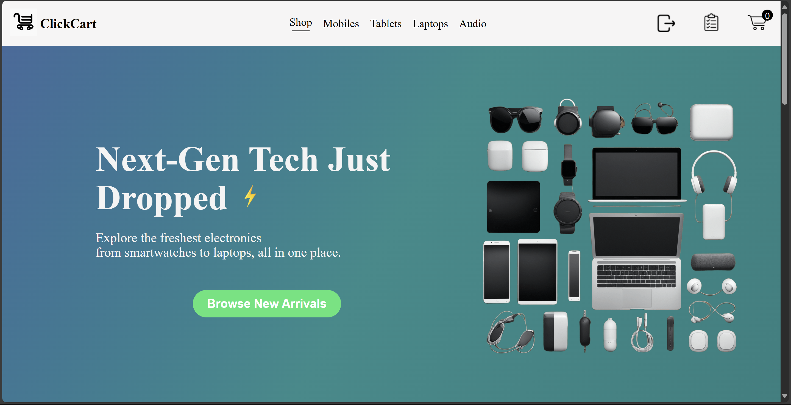
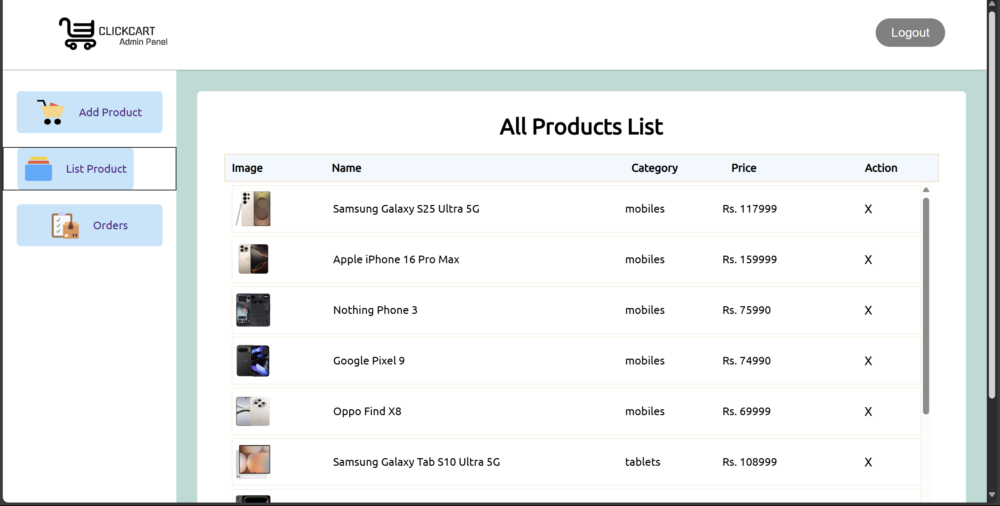
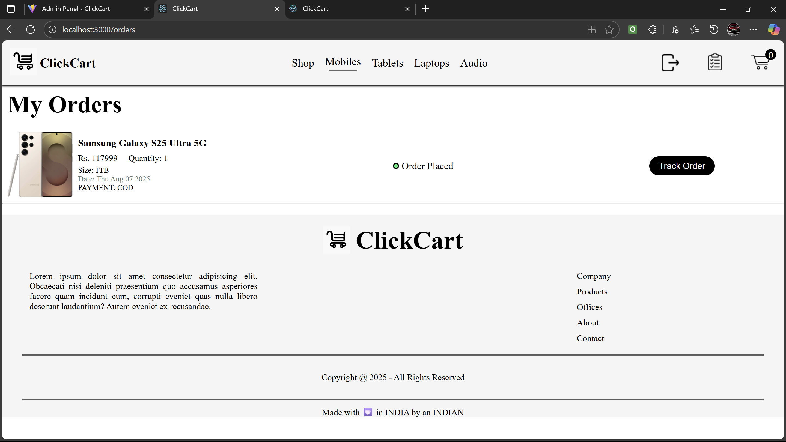

# 🛒 ClickCart – Electronics E-commerce Website

ClickCart is a full-stack e-commerce website focused on selling electronics such as mobiles, tablets, laptops, and audio products. It features a user-friendly shopping experience, admin product management, secure authentication, and cloud-based image storage.

---

## 📸 Screenshots

### 🏠 Home Page
  


### 🏠 Products Listings
  


### 🏠 My Orders
  
---

## 📁 Project Structure

```bash
ClickCart/
├── frontend/           # React frontend for users
├── backend/            # Express.js backend API
├── admin/              # Vite + React admin dashboard
├── Product Assests/    # All Products Images
├── Screenshots/        # Images of Website
└── README.md
```
---

## 🚀 Features

### 🌐 User Side (Frontend)
- 🖥️ Homepage with:
  - Hero banner
  - Popular mobiles
  - Membership banner 
  - New arrivals
- 📂 Category navigation: Mobiles, Tablets, Laptops, Audio
- 🛒 Shopping Cart 
- 🔐 JWT-based Login/Signup
- 📦 My Orders section for logged-in users

### 🔧 Admin Panel (Admin Folder)
- ➕ Add new products
- 📋 View and manage all listed products
- 📦 Manage customer orders
- 🔐 Separate Login for Admins

### ⚙️ Backend (Express)
- MongoDB for data storage
- JWT for secure authentication
- Cloudinary for product image uploads
- RESTful APIs for user, product, and order management

---

## 🛠️ Tech Stack

- **Frontend:** React, React Router, Axios, Toast
- **Admin Panel:** Vite + React, Axios, Toast
- **Backend:** Node.js, Express.js, MongoDB
- **Authentication:** JSON Web Tokens (JWT)
- **Image Storage:** Cloudinary, Multer
- **Database:** MongoDB with Mongoose

---

## 📦 Installation & Setup

### Prerequisites

- Node.js (v18+ recommended)
- MongoDB (Atlas)
- Cloudinary account

### 1. Clone the repository

```bash
git clone https://github.com/manan-hemani/clickcart.git
cd clickcart
```

### 2. Setup Environment Variables

```bash
# backend/.env
MONGODB_URI="your url"
CLOUDINARY_API_KEY="your api"
CLOUDINARY_SECRET_KEY="your key"
CLOUDINARY_NAME="your name"
JWT_SECRET="your secret key"
ADMIN_EMAIL="your admin email"
ADMIN_PASSWORD="your admin password"
```

```bash
# admin/.env
VITE_BACKEND_URL="your url"
```

```bash
# frontend/.env
REACT_APP_BACKEND_URL="your backend url"
REACT_APP_ADMIN_URL="your admin url"
```

### 3. Install Dependencies
```bash
# Backend

cd backend
npm install bcrypt cloudinary cors dotenv express jsonwebtoken mongoose multer nodemon validator

# Admin
cd ../admin
npm install react react-router-dom react-toastify axios

# Frontend
cd ../frontend
npm install react react-router-dom axios react-toastify
```

### 4. Run Project
```bash
# Start backend
cd backend
nodemon index.js

# Start frontend
cd ../frontend
npm start

# Start admin panel
cd ../admin
npm run dev
```

# 👨‍💻 Author
- **Manan Hemani** [Github](https://github.com/manan-hemani)

## 🙌 Acknowledgments

- MongoDB & Mongoose
- Cloudinary
- JWT Authentication
- React Ecosystem

## ❤️ Support

If you like this project, consider giving it a ⭐ on GitHub!  
Feedback and issues are always appreciated.
